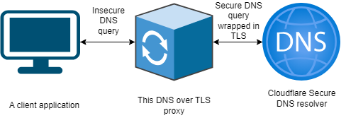

## DNS over TLS Proxy

### Contents
1. [Summary](#1-summary)
2. [Audience / Prerequisites](#2-audience--prerequisites)
    - [Before you start](#21-before-you-start)
3. [Procedure](#3-procedure)
    - [Start the proxy](#31-start-the-proxy)
    - [Test the proxy](#32-test-the-proxy)

### 1. Summary

This is a simple DNS over TLS proxy writen in Python and running in a container.
The conteiner is built with use of lightweight alpine and Python utilises only the default libraries.

The DNS over TLS proxy can be used to resolve DNS via a secure channel by any client including git, nslookup or a custom built client, etc..

Overview



The proxy listens on incoming DNS request via TCP and UDP and upstreams the requests to Cloudflare 1.1.1.1 secure resolver on port 853.
Responses received from Cloudflare are parsed and presented to the user.

### 2. Audience / Prerequisites
- Everyone

#### 2.1. Before you start
The DNS over TLS proxy runs in a Docker container and requires Docker or another container runtime to be installed.
- Install [Docker](https://docs.docker.com/engine/install)

Git is also required to clone this repository
- Install [Git](https://git-scm.com/downloads)

### 3. Procedure
This is `Info`

#### 3.1. Start the proxy

To start the DNS over TLS proxy in a container follow the steps below

1. Open a terminal
2. Clone this repository with Git
```
git clone https://github.com/deplab/dns-over-tls.git
```
3. Change the directory
```
cd dns-over-tls
```
4. Build a container image to start the DNS over TLS proxy container
```
docker build -t dnsovertlsproxy:1 .
```
5. Start the DNS over TLS proxy in a detached mode in a container
```
# Note that the host machine port that the proxy will be listening on is 8153
# This port can be changed to any other port that is not in use
docker run -d -p 8153:53/tcp -p 8153:53/udp dnsovertlsproxy:1
```
`NOTE` The default Upstream DNS Server used is Cloudflare (IP address 1.1.1.1), to overwrite (to e.g. Google 8.8.8.8), use `-e DNS_SERVER=8.8.8.8`
Example:
```
docker run -d -p 8153:53/tcp -p 8153:53/udp -e DNS_SERVER=8.8.8.8 dnsovertlsproxy:1
```

#### 3.2. Test the proxy

After completing the start up of the proxy (section 3.1)

- Test/Use the DNS over TLS proxy with `dig` on `MacOS` or `Linux`
```
dig @127.0.0.1 -p 8153 github.com
```

- Test/Use the DNS over TLS proxy with `nslookup` on `Windows`
```
nslookup -port=8153 github.com 127.0.0.1
```
